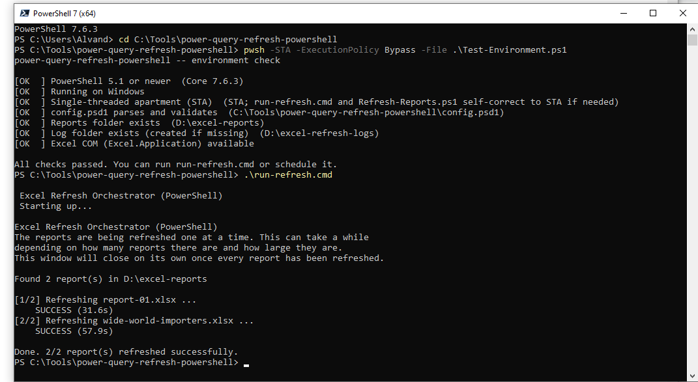
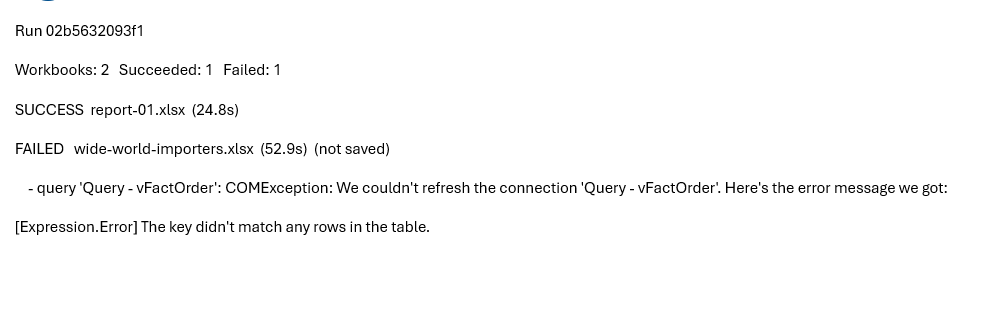

# Excel refresh orchestrator (PowerShell)

Automatically refresh a whole folder of Excel reports containing Power Query queries on a schedule, catching and reporting any query that fails, with a log you can build reports on and an optional Outlook summary email.

This is a pure PowerShell tool. It has **no external dependencies at all**: no Python, no NuGet packages, no modules to install. It drives the real Excel desktop application through COM using only what ships with Windows, so on a machine that already has Excel there is nothing to `install` before the first run.

> This is a PowerShell port of my Python solution, [power-query-refresh-xlwings](https://github.com/Amingharaei/power-query-refresh-xlwings), which does the same job using [xlwings](https://www.xlwings.org/). Reach for this one when you would rather not deal with Python at all and want everything done in PowerShell with nothing to install: no interpreter, no virtual environment, no packages, just the Windows and Excel you already have. The two are deliberately built the same way (config, event log, engine, entry point), so if you know one you know the other.

> **Windows only.** It drives the Excel desktop application, so it needs Excel installed and a logged-in, awake session at the scheduled time. The optional email uses the Outlook desktop app you are already signed in to.

---

## The problem this program solves

Power Query doesn't refresh itself. To update a report you open the workbook, click **Data -> Refresh All**, wait, and save. With one report that is a minor chore. With ten or a hundred it is a real time sink, it is easy to forget, and it never happens overnight when you would want it to.

This tool does that for you. You point it at a folder and it opens each workbook, refreshes its queries, saves, and moves on, unattended, on whatever schedule you set. It refreshes each query individually so that when one fails (a renamed source column, a missing view, a database error) it tells you **which** query failed and **why**, instead of silently reporting success on stale data. Drop a new workbook into the folder and it is included on the next run; there is nothing to set up per file.

---

## How it works, and why it is built this way

Three decisions do most of the work here. Each one exists because the obvious approach is quietly wrong.

### Every query is refreshed and checked individually

The obvious way to refresh a workbook from code is `Workbook.RefreshAll()`. When driven from code, `RefreshAll` **does not** raise or return an error when a query fails. It kicks off the refreshes and returns, and a broken query fails silently while the call reports nothing. If you save after that, you have just overwritten a good report with stale data and recorded a success.

Instead, this tool walks `Workbook.Connections`, sets `BackgroundQuery = $false` on each one (so the refresh call blocks until that query actually finishes), and calls `Refresh()` on each connection inside its own `try/catch`. A failure is therefore caught, attributed to the exact query that failed, timed, and logged, with the real error message straight from the source.

### If any query fails, the workbook is not saved

A half-updated report (some tables fresh, one stale, no visible sign which) is worse than an obviously old one. So the rule is all-or-nothing: if any query in a workbook fails, that workbook is closed **without saving** and keeps its last good version on disk. The failure is logged and, if email is on, included in the summary. Only when every query in the workbook succeeds is the workbook recalculated and saved.

### The timeout watchdog runs on its own OS thread, in compiled code

This one's specific to doing COM automation from PowerShell, and it's easy to get wrong.

While PowerShell is blocked inside a COM `Refresh()` call waiting on a slow or hung query, nothing else on that thread runs. A PowerShell timer, a `Register-ObjectEvent` handler, a `Start-Job` callback, a `Wait` loop: none of them can fire, because they all need the pipeline thread, and that thread is stuck in the COM call. So a naive "start a timer, then refresh" approach can't actually enforce a timeout. The timer's callback just sits queued behind the very call it's supposed to interrupt.

The only thing that can act while the pipeline thread is blocked is an independent OS thread. So the watchdog is a small compiled type (`Add-Type`, C#) that arms a `System.Threading.Timer`. That timer fires on a thread-pool thread, outside PowerShell's pipeline entirely, and if the timeout elapses it kills the specific Excel process by PID. The blocked `Refresh()` throws, the failure gets recorded as a timeout, and the run moves to the next workbook.

To kill the right Excel and not some user's other spreadsheet, the tool identifies exactly the process it launched: it reads `Application.Hwnd`, resolves the owning process id via `GetWindowThreadProcessId` (a two-line P/Invoke in the same compiled type), and falls back to a before/after process-snapshot diff if that fails. Each workbook gets its own fresh, invisible Excel instance, so one bad file can't take down the rest of the batch, and after each workbook the COM objects get released and the process gets confirmed gone, with a hard `Stop-Process` backstop for the rare case where `Quit()` doesn't take.

### The files

The tool is split the way the responsibilities split, so each file is small and readable:

- `config.psd1` reads your settings. It is a PowerShell data file, parsed with `Import-PowerShellDataFile` in restricted language, so it cannot execute code and needs no parser.
- `src/Config.ps1` loads and validates those settings.
- `src/EventLog.ps1` writes the tabular event log (CSV) and the rotating text log.
- `src/ExcelEngine.ps1` finds the workbooks and does the Excel work (open, refresh each query, save) with the watchdog.
- `src/Notify.ps1` builds and sends the optional Outlook summary.
- `Refresh-Reports.ps1` is the program you run. It loops the workbooks, logs each result, prints progress, sends the summary, and sets the exit code.
- `run-refresh.cmd` is what Task Scheduler (or a double-click) points at. It picks PowerShell 7 if present, otherwise Windows PowerShell 5.1, and pins the apartment state (see below).
- `Register-ScheduledRefresh.ps1` registers the scheduled task for you, configured correctly for Excel.
- `Test-Environment.ps1` is a preflight check you can run before scheduling.

The source files are wired together by dot-sourcing, not modules. That is deliberate: it keeps class and function definitions in one scope without the parse-order and relative-path friction that `using module` brings.

---

## A note on the apartment state (STA)

Excel COM must run in a **single-threaded apartment (STA)**. In an MTA (multi-threaded apartment) Excel automation is either catastrophically slow or fails outright. A normal Windows PowerShell 5.1 session and a normal PowerShell 7 (`pwsh`) session are both STA already, so most of the time this is invisible. But some contexts are MTA, most notably background runspaces, jobs, and the **VS Code integrated console**.
Two things handle it for us. `run-refresh.cmd` launches PowerShell with the `-STA` switch. And `Refresh-Reports.ps1` checks its own apartment state on startup and, if it finds itself in MTA, relaunches itself once in STA (passing a flag so it never loops).

---

## PowerShell 7 or Windows PowerShell 5.1?

Either works. The tool is written to run unchanged on Windows PowerShell 5.1 (the `powershell.exe` that ships in the box on every Windows 10/11 machine) and on PowerShell 7+ (`pwsh.exe`). `run-refresh.cmd` prefers `pwsh` if it is installed and falls back to `powershell` otherwise, so you do not need to install anything, and if you later add PowerShell 7 it will simply start using it.

---

## Setup, step by step

### Step 1 - Create the folders

Create the folders first. For example, on your **D:** drive:

- `D:\excel-reports` - put the workbooks you want refreshed in here.
- `D:\excel-refresh-logs` - the logs are written here automatically.

You can name them anything and put them anywhere; you will enter your choices in Step 3.

### Step 2 - Put the project on your PC

Copy the project folder to a permanent location, for example `C:\Tools\power-query-refresh-powershell`. There is nothing to install.

### Step 3 - Edit your settings

Open `config.psd1` in any text editor and set the two paths:

```powershell
Paths = @{
    ReportsDir = 'D:\excel-reports'
    LogDir     = 'D:\excel-refresh-logs'
}
```

Keep the single quotes so backslashes are taken literally. The rest of the file has sensible defaults and is commented; give it a read. Turning on email is covered below.

### Step 4 - Prepare Excel once

So the refresh can run unattended without a prompt stopping it:

1. **Trusted Locations.** In Excel go to **File -> Options -> Trust Center -> Trust Center Settings -> Trusted Locations -> Add new location**, and add your reports folder (tick "Subfolders" if you use them). A Trusted Location lets the files open and their data connections run without a security prompt; there is no separate "enable data connections" step to do.
2. **Only if your reports connect to databases, SharePoint, Azure, Fabric, and so on:** open each such report once and sign in when prompted. Windows remembers those logins so later unattended runs reuse them, which is why this tool never asks for source passwords.

### Step 5 - Check the environment (recommended)

Before scheduling, confirm the machine can actually run everything.
first set the working directory to the project folder:

```powershell
cd C:\Tools\power-query-refresh-powershell
```
Now run this:

```powershell
pwsh -STA -ExecutionPolicy Bypass -File .\Test-Environment.ps1
```

(Use `powershell` instead of `pwsh` if you are on Windows PowerShell 5.1.) It verifies PowerShell version, Windows, apartment state, that your config parses, that the folders exist, and that Excel COM (and Outlook, if email is on) instantiate. It does not open or refresh any workbook.

### Step 6 - Test it manually

Run it once and check the result. Either double-click `run-refresh.cmd`, or from a PowerShell window in the project folder:

```powershell
.\run-refresh.cmd
```

You will see per-report progress in the console. When it finishes, open your log folder: `refresh-events.csv` has a row per event and `excel_refresh.log` is the readable version. Confirm the right workbooks refreshed and that any failures make sense.

This is the combined expected result of running the environment test and the manual refresh:



### Step 7 - Schedule it

I have added a task creator script in addition to manual task creation in task scheduler, so pick one.

**1- Script.** From the project folder:

```powershell
.\Register-ScheduledRefresh.ps1 -At 02:00
```

or, for a weekly schedule:

```powershell
.\Register-ScheduledRefresh.ps1 -Frequency Weekly -DaysOfWeek Monday,Thursday -At 22:00
```

This registers a task named `PowerQueryRefresh` (override with `-TaskName`) that runs `run-refresh.cmd`, configured with the interactive logon type Excel needs, and requiring no admin rights. Remove it later with `Unregister-ScheduledTask -TaskName 'PowerQueryRefresh'`.

**2- Through the Task Scheduler GUI.** 

1. Open **Task Scheduler**, choose **Create Task** (not "Basic Task"):

2. **General tab:** name it, and select **"Run only when the user is logged on."** This is essential: Excel automation needs a real desktop. The other option, "run whether logged on or not," runs with no desktop and Excel will fail.
3. **Triggers tab -> New:** choose Daily or Weekly and a start time.
4. **Actions tab -> New:** Action = *Start a program*. Program/script = the full path to `run-refresh.cmd`.

**Either way, the PC must be on and this user logged on at the scheduled time.** Excel automation cannot run on a locked-out or logged-off session.

---

## Turning on the email summary

Email is off by default and uses the Outlook desktop app you are already signed in to, so there is no password and no SMTP setup. In `config.psd1`:

```powershell
Email = @{
    Enabled    = $true
    Recipients = @('you@company.com', 'teammate@gmail.com')
    SendOn     = 'always'      # or 'failure' to email only when something fails
}
```

The summary shows how many workbooks succeeded or failed and, for each failure, the workbook, the specific failing query, and the error. Sending mail never changes the run's result: if Outlook cannot send, that is logged and the run still reports its real status.

Here is a message you can expect:



---

## The logs and building reports on them

Two files are written to the log folder.

`refresh-events.csv` is a tidy, append-only table, one row per event, ideal for a Power BI or Excel report over time. It is written as UTF-8 without a BOM with RFC 4180 quoting and CRLF line endings, so it loads cleanly anywhere. Every row from a single run shares a `run_id`.

`excel_refresh.log` is a rotating, human-readable log for debugging a single run (it rolls over at about 2 MB, keeping five back copies).

The CSV columns:

| Column | Meaning |
| --- | --- |
| `run_id` | Identifier shared by all rows from one run. |
| `timestamp` | When the event happened (local time, millisecond precision, with UTC offset; ISO 8601). |
| `scope` | `run`, `workbook`, or `connection` (a single query). |
| `target` | The reports folder, the workbook file name, or the query/connection name. |
| `event` | `RUN`, `WORKBOOK`, or `REFRESH` (a query refresh). |
| `status` | `STARTED`, `SUCCESS`, `FAILED`, or `SKIPPED`. |
| `duration_seconds` | How long that query / workbook / run took. |
| `error_type` / `error_message` | The error, when something failed (for example the source message naming the missing column or view). |
| `detail` | A short note (why a query was skipped, or the failure count on a workbook). |

You can chart success rate over time, find the slowest queries and workbooks, and see the failure history of any single query.

---

## Why do some connections show as SKIPPED?

You will see rows with a `SKIPPED` status. That means *this connection was never meant to be refreshed directly*, not *this data is stale*. It is expected behavior, not a flaw.

Every workbook connection exposes a `Type` from Excel's `XlConnectionType` enum. This tool only treats a connection as refreshable when its type is `xlConnectionTypeOLEDB` (1) or `xlConnectionTypeODBC` (2), the two types that actually pull rows from an external source and can fail with a source-level error. Power Query connections are OLEDB.

`ThisWorkbookDataModel` and any `ModelConnection_ExternalData_N` connection are `xlConnectionTypeMODEL` (7). They are internal links into the workbook's own Data Model, not a data source, so the tool correctly leaves them alone. The actual data refresh flows through the individual Power Query connections.
